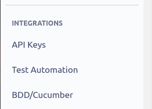
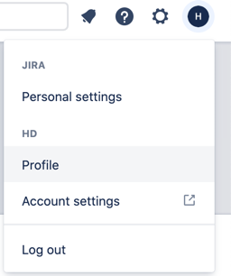

# Zephyr_for_Jira-server-to-cloud-migration
#### Zephyr for Jira Server to Cloud Migration

### <i>Major upgrade</i>
As part of latest release we have updated the mapping file creation of test steps and execution in <b>.xlsx</b> format.
The new build will not work with already migrated projects since earlier the tool was creating <b>.xls</b> format file and it
will not be able to read the .xls format files.
Use the latest build for new projects.
Keep the old precompiled jars for already migrated project(s).

### <i>New properties added to improve migration process time.</i>
#### By default the properties are set to <i>'true'</i>
1. <b>migrate.step.results.attachment</b> : If there are no step results attachment in the server instance, then this property 
can be set to <i>'false'</i> to avoid fetching data from Zephyr Server.
2. <b>migrate.test.steps.attachment</b> : If there are no test steps level attachment in the server instance, then this property 
can be set to <i>'false'</i> to avoid fetching data from Zephyr Server.
3. <b>migrate.update.step.results</b> : If user wish not to update the step results status in cloud instance, then this property 
can be set to <i>'false'</i> to avoid fetching data from Zephyr Server & uploading the data in zephyr cloud.

###### Please read the below instructions to setup the configuration
1. Run <b>‘mvn clean install’</b> command to build the package.
2. Run <b>‘mvn spring-boot:run’</b> command to run the application. 
This will launch the spring boot server at default port 8080.
3. The default properties can be updated in <i>application.properties</i> file.

###### Prerequisite for the application.
1) Server Base Url
2) Server Admin Credentials
3) Cloud Zephyr Admin User Credentials.
{AccountId, AccessKey, SecretKey}`

##### To Generate the API keys.
1. Navigate to Apps from top menu section.
2. Navigate to Zephyr Squad.
3. Click on API keys from the sub-menu.
4. Find the available keys associated with account or generate one new :)

##### To Get the user account ID from JIRA.
1. Click on the User icon & navigate to profile section.
2. In the address bar, you will get the user account id from Atlassian.

###### **To Trigger the migration**

Launch the application at <b>http://{localhost:port}/beginMigration</b>   

Provide the project id & begin the process.

###### To View the migration logs.

Navigate to the home directory of the project. It will have a directory created with name 'migration/logs'

###### To View the migration mapping files. 
Navigate to the path specified in the application.properties
It will have the mapping file created for the migration project.

### To use the precompiled migration tool.
##### Java should be installed & Java home path should be configured correctly.

1. Navigate to the /Zephyr_for_Jira-server-to-cloud-migration/PreCompiled-Jars
2. Download the zip files.
3. Modify the application.properties file with specific instance information.
   (Migration File Path, Port, Server instance details, Cloud instance details)
    
4. Save the application.properties file after making the necessary changes.
5. Run the below command to launch the application and it will launch the application at mentioned port.

java -jar Zephyr_for_Jira-server-to-cloud-migration-1.0.jar --spring.config.location=file:./application.properties

#### Pre checkup list before triggering the migration. ####
1. Uninstall the ZSquad plugin from the manage Apps if you have.
2. Rename the migrated Issue Type from server 'Test' to 'Test_Migrated'
3. Install the ZSquad addon from the marketplace. It will create the issue type 'Test' w.r.t cloud instance.
4. Perform the bulk migration of issues from 'Test_Migrated' to 'Test'
5. Validate the migrated issues associated with new issue type 'Test'.
6. Perform the project meta data reindex. The re-index is performed by going to COG/Settings > Apps > General configuration (under ZSquad) 
and project meta re-indexing.

P.S. Please select single project from the list instead of 'All Projects' in case 'All Projects' fails with an error.
   

