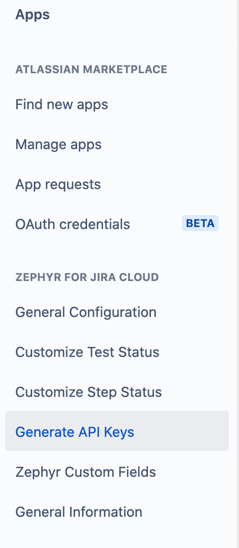

# Zephyr_for_Jira-server-to-cloud-migration
#### Zephyr for Jira Server to Cloud Migration

###### Please read the below instructions to setup the configuration
1. Run ‘mvn clean install’ command to build the package.
2. Run ‘mvn spring-boot:run’ command to run the application. 
This will launch the spring boot server at default port 8080.
3. The default properties can be updated in application.properties file.

###### Prerequisite for the application.
1) Server Base Url
2) Server Admin Credentials
3) Cloud Zephyr Admin User Credentials.
{AccountId, AccessKey, SecretKey}`

##### To Generate the API keys.
1. Navigate to Manage Apps section from settings section.
2. Navigate to Zephyr for Jira Cloud.
3. Click on Generate API keys.
4. Find the available keys associated with account or create one new :)

##### To Get the user account ID from JIRA.
1. Click on the User icon & navigate to profile section.
2. In the address bar, you will get the user account id from Atlassian.

###### **To Trigger the migration**

Launch the application at http://{localhost:port}/beginMigration   

Provide the project id & begin the process.

###### To View the migration logs.

Navigate to the home directory of the project. It will have a directory created with name 'migration/logs'

###### To View the migration mapping files. 
Navigate to the path specified in the application.properties
It will have the mapping file created for the migration project.

### To use the precompiled migration tool.
##### Java should be installed & Java home path should be configured correctly.
1. Navigate to the /Zephyr_for_Jira-server-to-cloud-migration/PreCompiled-Jars
2. Download the zip files.
3. Modify the application.properties file with specific instance information.
   (Migration File Path, Port, Server instance details, Cloud instance details)
    
4. Save the application.properties file after making the necessary changes.
5. Run the below command to launch the application.

java -jar Zephyr_for_Jira-server-to-cloud-migration-1.0.jar --spring.config.location=file:./application.properties

6. It will launch the application at mentioned port.   

